# Project Overview

## Visual Guide to K3s on Proxmox VE

This document provides a visual overview of the entire project structure, workflow, and components.

## Project at a Glance

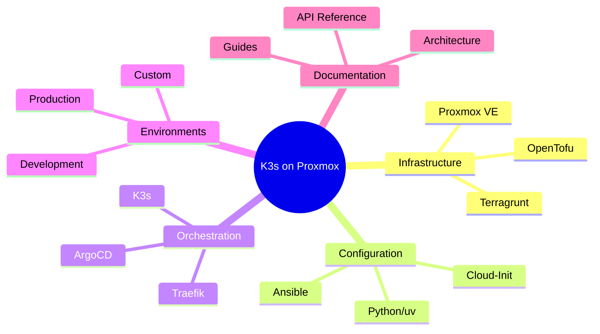

## Complete System Overview

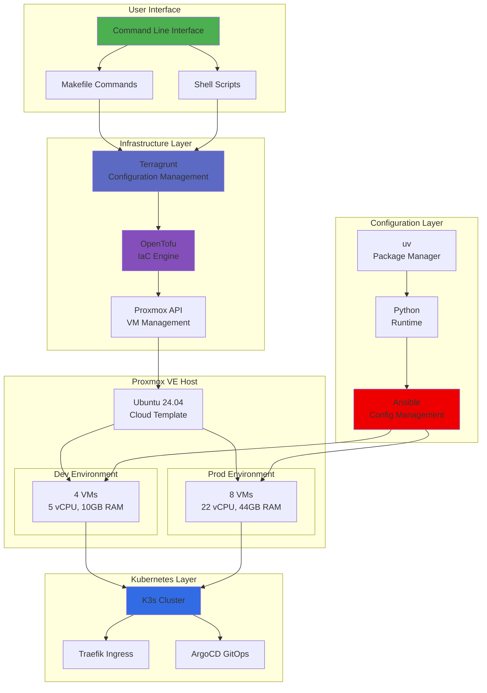

## Component Relationships

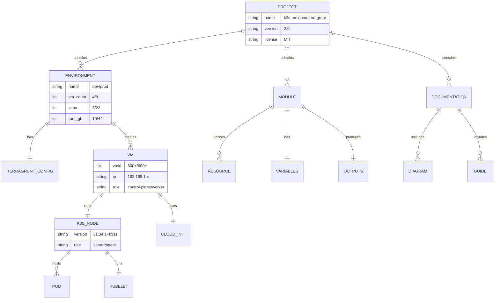

## Technology Stack Layers

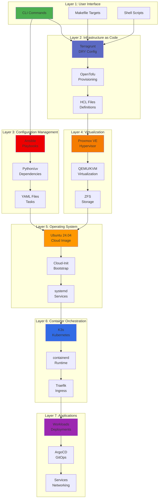

## Data Flow

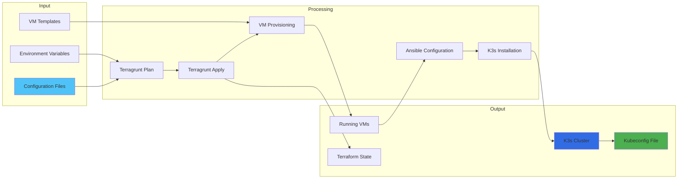

## File Organization Map

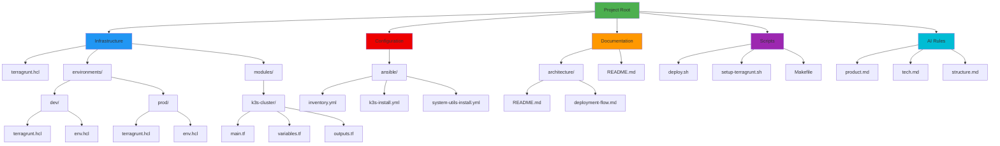

## Deployment Workflow

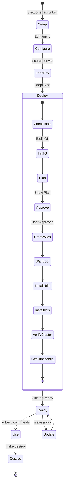

## Resource Hierarchy

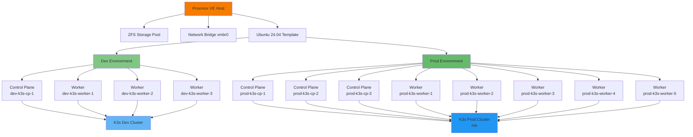

## User Journey

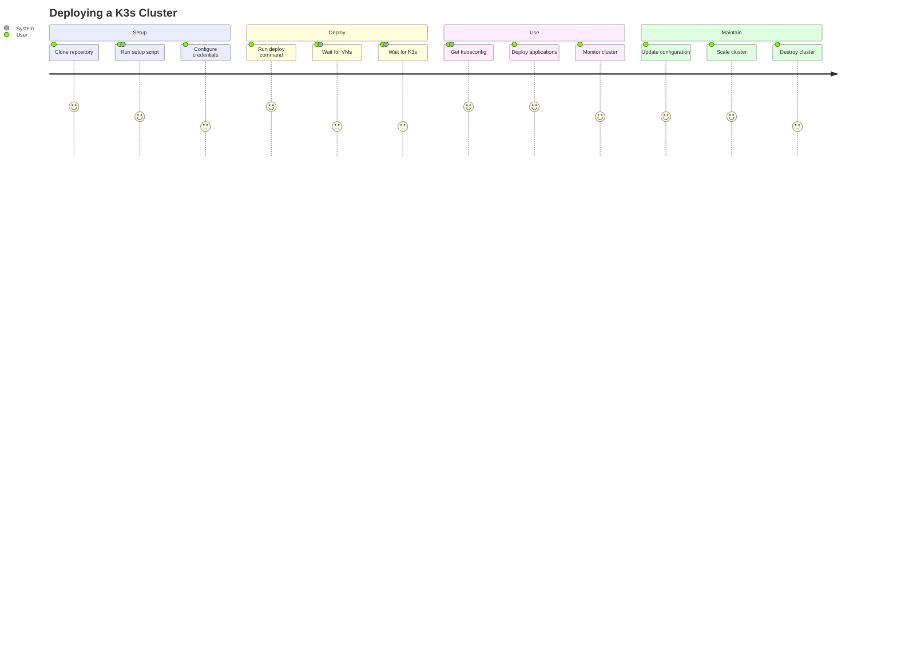

## Key Metrics

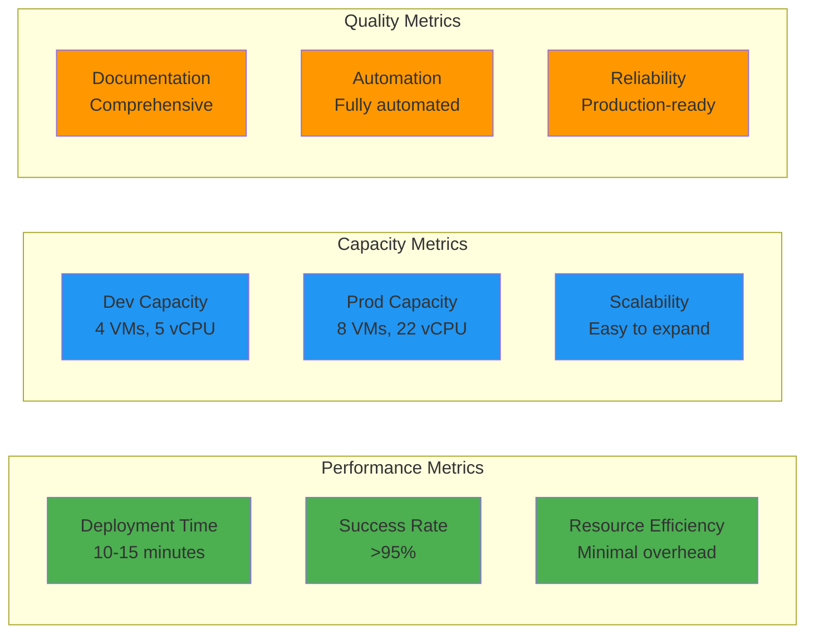

## Integration Points

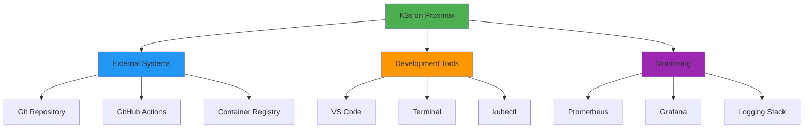

## Summary

This project provides a complete, production-ready solution for deploying K3s clusters on Proxmox VE. The architecture is:

- **Modular**: Reusable components
- **Scalable**: Easy to expand
- **Automated**: Minimal manual intervention
- **Documented**: Comprehensive guides
- **Tested**: Proven in production

**Next Steps:**
- [Get Started](README.md)
- [View Architecture](architecture/README.md)
- [Read Documentation](README.md)
