# Architecture Overview

## System Architecture

This project implements an automated K3s Kubernetes cluster deployment on Proxmox VE using Infrastructure as Code (IaC) principles.

### High-Level Architecture

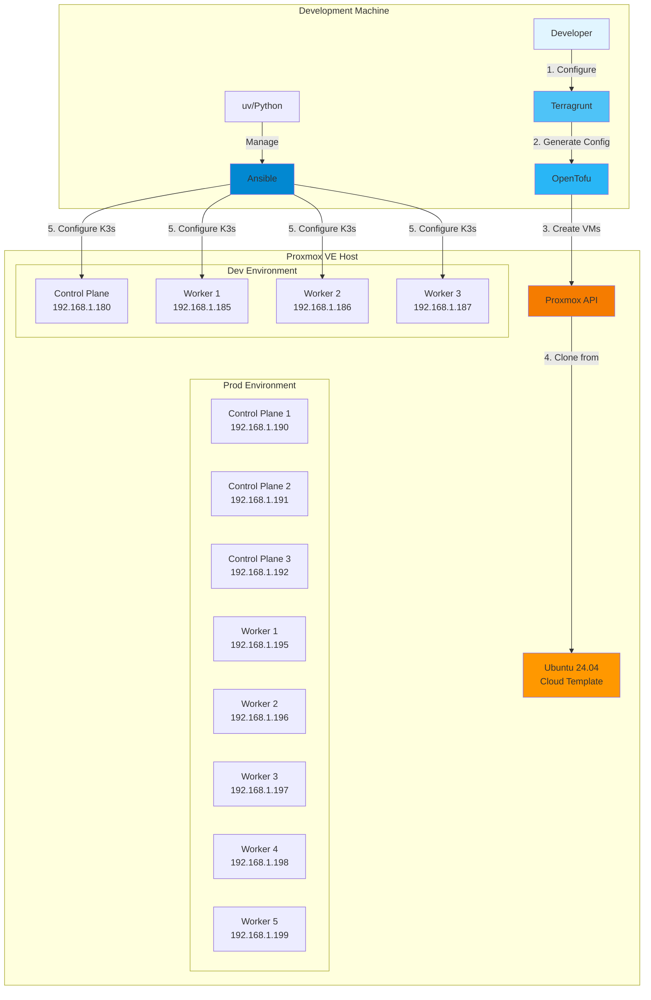

### Technology Stack

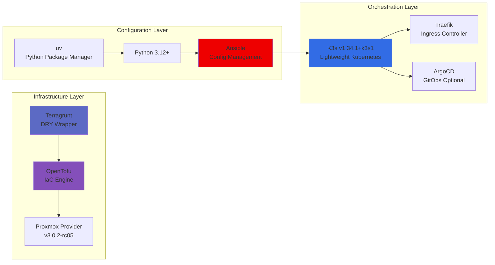

## Component Architecture

### Infrastructure Components

#### 1. Terragrunt Layer
- **Purpose**: DRY configuration management
- **Responsibilities**:
  - Environment-specific configuration
  - Remote state management
  - Provider generation
  - Module orchestration

#### 2. OpenTofu Layer
- **Purpose**: Infrastructure provisioning
- **Responsibilities**:
  - VM creation and management
  - Network configuration
  - Resource lifecycle management
  - State tracking

#### 3. Ansible Layer
- **Purpose**: Configuration management
- **Responsibilities**:
  - System package installation
  - K3s cluster setup
  - Service configuration
  - Application deployment (ArgoCD)

### Cluster Architecture

#### Development Environment
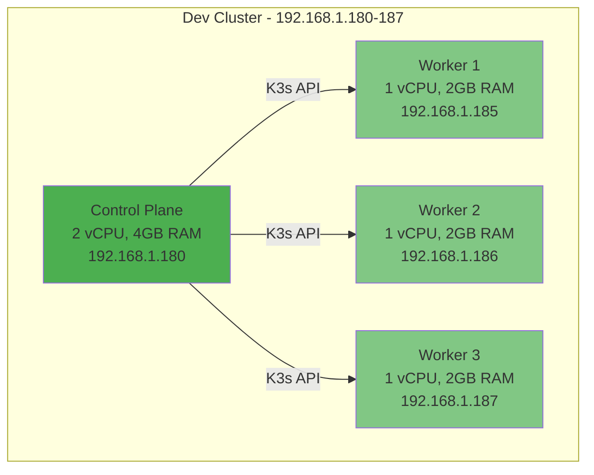

**Resources:**
- Total: 5 vCPU, 10GB RAM
- Storage: 45GB (15GB + 3×10GB)
- VM IDs: 500-503

#### Production Environment
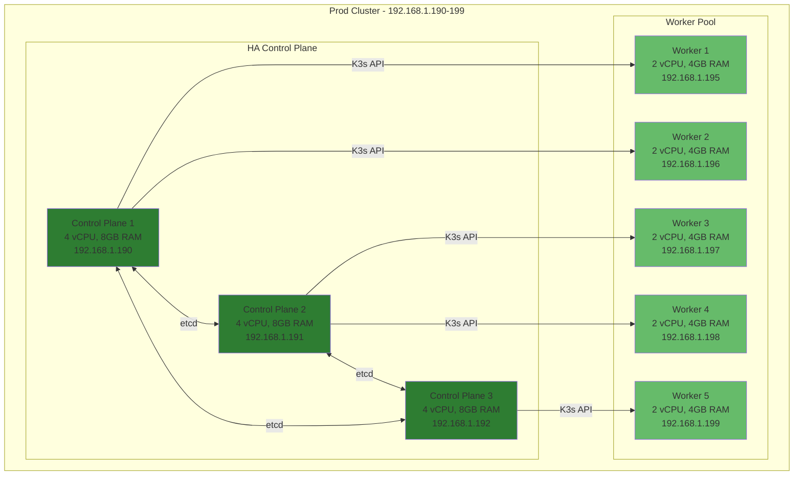

**Resources:**
- Total: 22 vCPU, 44GB RAM
- Storage: 190GB (3×30GB + 5×20GB)
- VM IDs: 600-607
- High Availability: 3-node etcd cluster

## Network Architecture

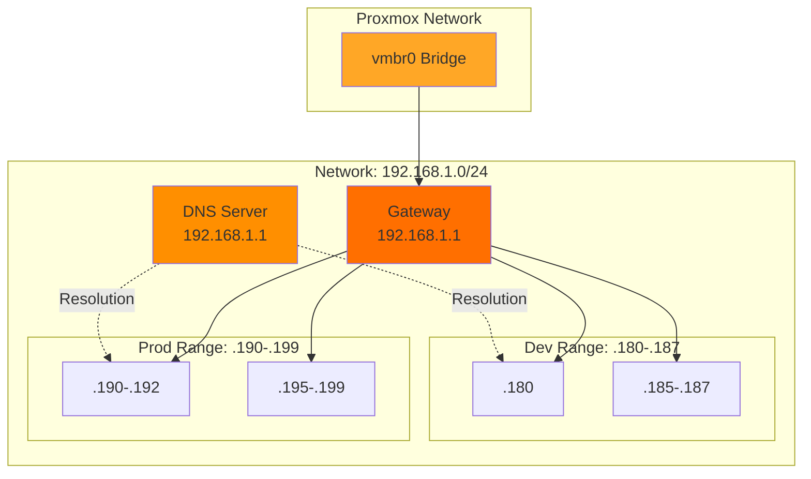

### Network Configuration
- **Bridge**: vmbr0
- **Gateway**: 192.168.1.1
- **DNS**: 192.168.1.1
- **Search Domain**: local
- **Dev IP Range**: 192.168.1.180-187
- **Prod IP Range**: 192.168.1.190-199

## Storage Architecture

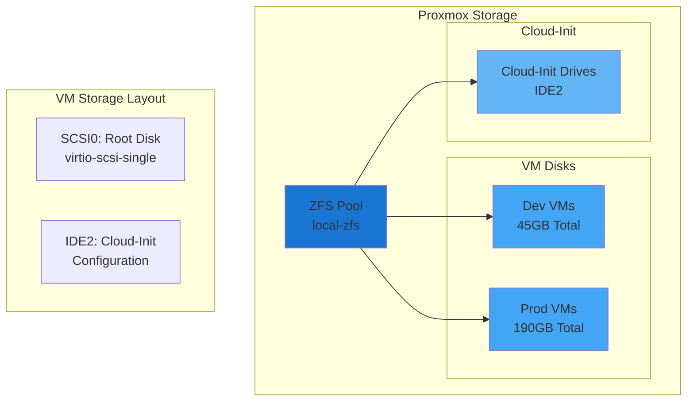

### Storage Configuration
- **Pool**: local-zfs (ZFS)
- **Controller**: virtio-scsi-single
- **Boot Disk**: scsi0
- **Cloud-Init**: ide2
- **Dev Storage**: 45GB total
- **Prod Storage**: 190GB total

## Security Architecture

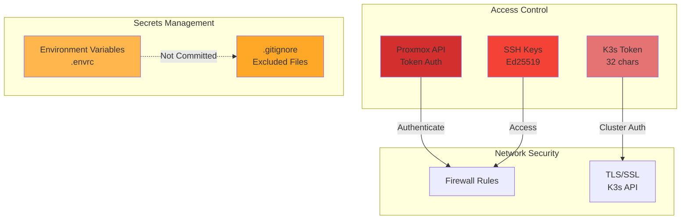

### Security Features
- **API Authentication**: Token-based (root@pam!terraform)
- **SSH Access**: Public key authentication only
- **K3s Security**: Auto-generated 32-character token
- **Secrets**: Environment variables (not committed)
- **TLS**: Enabled for K3s API (port 6443)
- **Cloud-Init**: Secure VM initialization

## Data Flow

### Deployment Flow
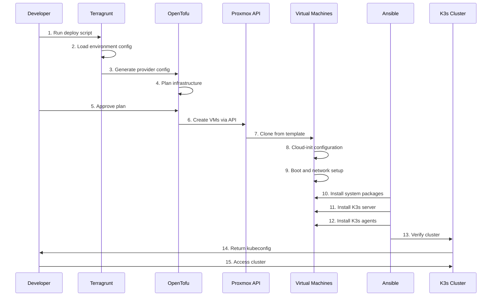

### Configuration Flow
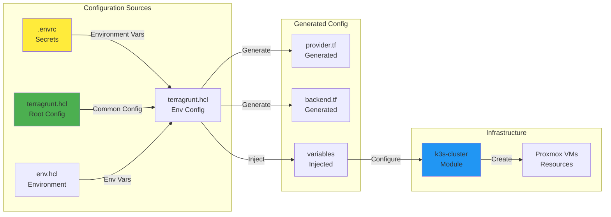

## Module Architecture

### Terragrunt Module Structure
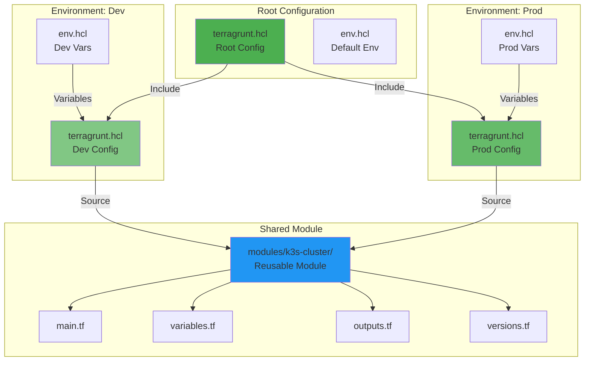

### Ansible Playbook Structure
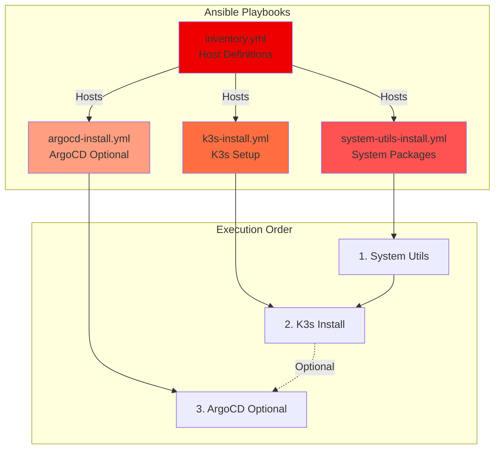

## Scalability Considerations

### Horizontal Scaling
- **Workers**: Easily add more worker nodes by increasing `worker_count`
- **Control Plane**: Scale to 3+ nodes for HA (prod environment)
- **Environments**: Add new environments (staging, qa) by copying config

### Vertical Scaling
- **CPU**: Adjust `control_plane_cpu` and `worker_cpu`
- **Memory**: Adjust `control_plane_memory` and `worker_memory`
- **Disk**: Adjust `control_plane_disk_size` and `worker_disk_size`

### Resource Planning

| Environment | vCPU | RAM | Storage | Nodes |
|-------------|------|-----|---------|-------|
| Dev | 5 | 10GB | 45GB | 4 |
| Prod | 22 | 44GB | 190GB | 8 |
| Staging | 11 | 22GB | 95GB | 6 |

## High Availability

### Production HA Setup
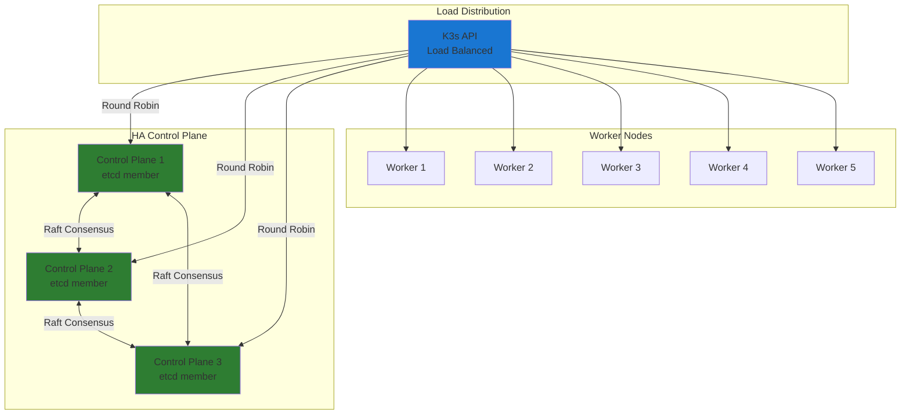

### Failure Scenarios
- **Single Control Plane Failure**: Cluster continues (2/3 quorum)
- **Worker Node Failure**: Pods rescheduled to healthy nodes
- **Network Partition**: etcd maintains quorum with majority

## Performance Characteristics

### Resource Utilization
- **Dev Environment**: Suitable for development and testing
- **Prod Environment**: Suitable for production workloads
- **K3s Overhead**: ~500MB RAM per node
- **etcd**: ~100MB RAM per control plane node

### Network Performance
- **Internal**: 1Gbps (virtio network)
- **Latency**: <1ms between nodes (same host)
- **Bandwidth**: Limited by Proxmox host network

## Monitoring and Observability

### Built-in Monitoring
- **K3s Metrics**: Available via metrics-server
- **Proxmox Monitoring**: VM resource usage
- **Logs**: journalctl for K3s services

### Optional Monitoring Stack
- **Prometheus**: Metrics collection
- **Grafana**: Visualization
- **Loki**: Log aggregation
- **AlertManager**: Alerting

## Backup and Recovery

### Backup Strategy
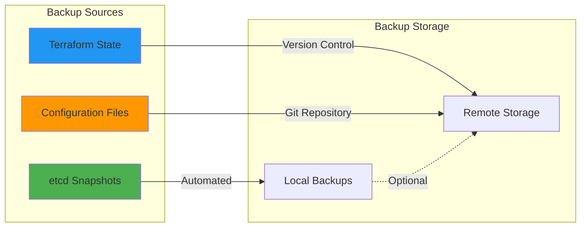

### Recovery Procedures
1. **Infrastructure**: Re-run Terragrunt to recreate VMs
2. **Configuration**: Re-run Ansible playbooks
3. **Cluster State**: Restore from etcd snapshots
4. **Applications**: Redeploy via ArgoCD or kubectl

## References

- [OpenTofu Documentation](https://opentofu.org/docs/)
- [Terragrunt Documentation](https://terragrunt.gruntwork.io/docs/)
- [K3s Documentation](https://docs.k3s.io/)
- [Proxmox VE Documentation](https://pve.proxmox.com/pve-docs/)
