# Deployment Flow Documentation

## Overview

This document details the complete deployment flow from initial setup to a running K3s cluster.

## Deployment Phases

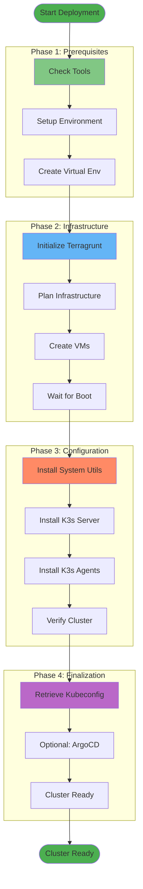

## Phase 1: Prerequisites Check

### Tool Verification
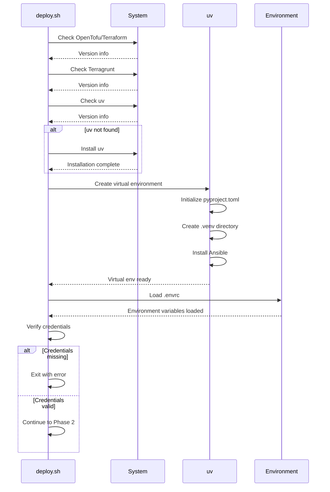

### Environment Setup Steps

1. **Check OpenTofu/Terraform**
   ```bash
   if command -v tofu; then
       TF_CMD="tofu"
   elif command -v terraform; then
       TF_CMD="terraform"
   else
       exit 1
   fi
   ```

2. **Check Terragrunt**
   ```bash
   if ! command -v terragrunt; then
       echo "Install Terragrunt"
       exit 1
   fi
   ```

3. **Setup Python Virtual Environment**
   ```bash
   if [ ! -d .venv ]; then
       uv init --no-readme --no-workspace
       uv venv --seed
   fi
   source .venv/bin/activate
   uv pip install -r requirements.txt
   .venv/bin/ansible-galaxy install -r requirements.yml
   ```

4. **Load Environment Variables**
   ```bash
   source .envrc
   # Verify required variables
   echo $PROXMOX_API_TOKEN_SECRET
   echo $SSH_PUBLIC_KEY
   ```

## Phase 2: Infrastructure Provisioning

### Terragrunt Initialization
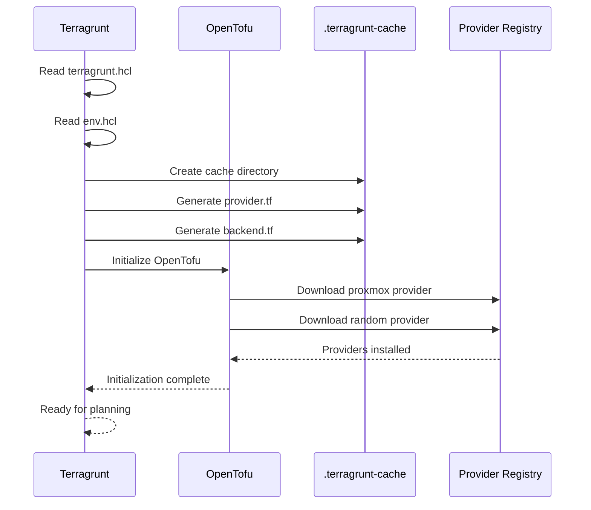

### Infrastructure Planning
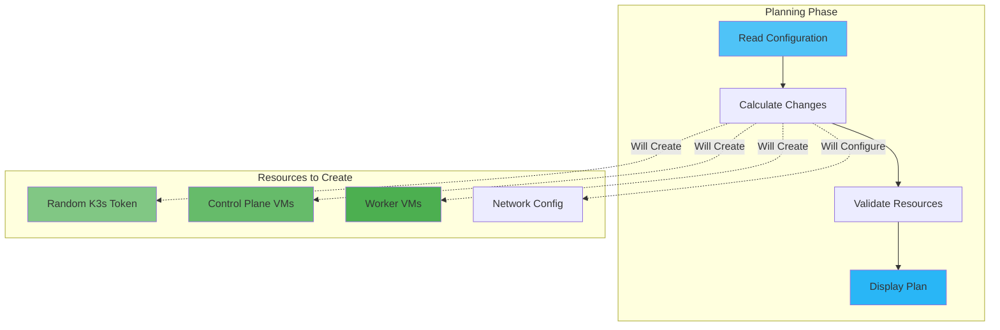

### VM Creation Process
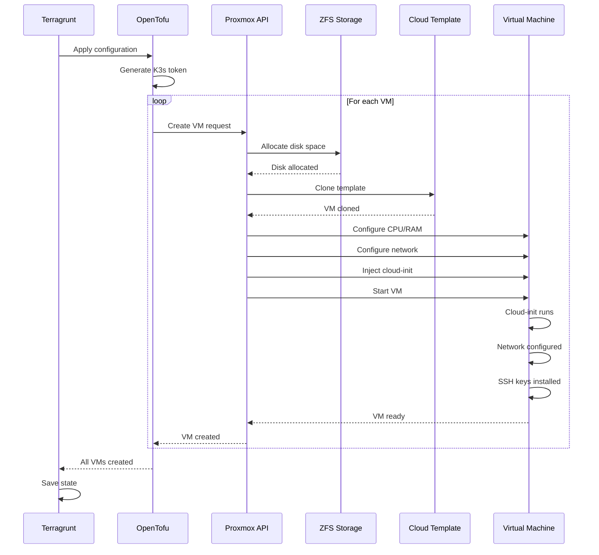

### Resource Creation Order

1. **Random Token Generation**
   ```hcl
   resource "random_password" "k3s_token" {
     length  = 32
     special = false
   }
   ```

2. **Control Plane VMs**
   - Created first (startup order=1)
   - Configured with higher resources
   - Assigned sequential IPs starting from control_plane_ip_start

3. **Worker VMs**
   - Created after control plane (depends_on)
   - Startup order=2
   - Assigned sequential IPs starting from worker_ip_start

## Phase 3: Configuration Management

### Ansible Execution Flow
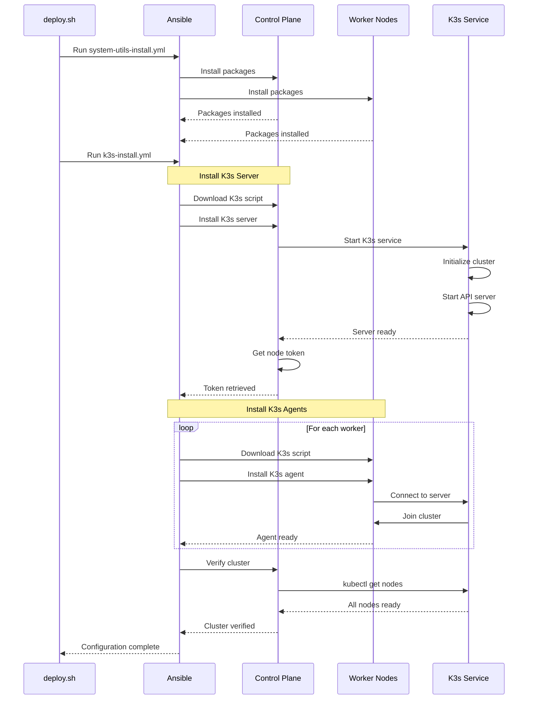

### System Utilities Installation

**Playbook**: `ansible/system-utils-install.yml`


**Packages Installed**:
- curl
- apt-transport-https
- ca-certificates
- micro (text editor)
- htop (process monitor)
- net-tools (networking utilities)

### K3s Installation Process

**Playbook**: `ansible/k3s-install.yml`

#### Control Plane Setup
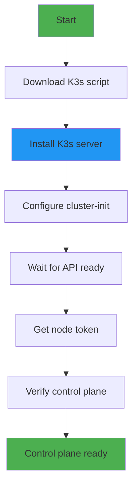

**Installation Command**:
```bash
INSTALL_K3S_VERSION=v1.34.1+k3s1 \
K3S_TOKEN=<generated-token> \
sh /tmp/k3s-install.sh server \
  --cluster-init \
  --write-kubeconfig-mode=644 \
  --tls-san=<control-plane-ip> \
  --node-name=<hostname>
```

#### Worker Setup
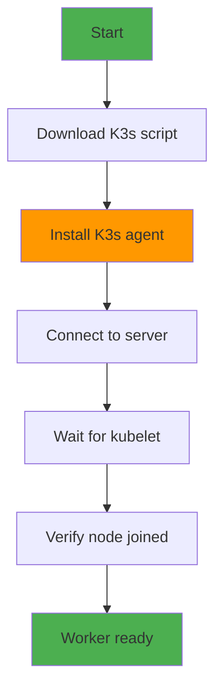

**Installation Command**:
```bash
INSTALL_K3S_VERSION=v1.34.1+k3s1 \
K3S_URL=https://<control-plane-ip>:6443 \
K3S_TOKEN=<node-token> \
sh /tmp/k3s-install.sh agent \
  --node-name=<hostname>
```

### Cluster Verification
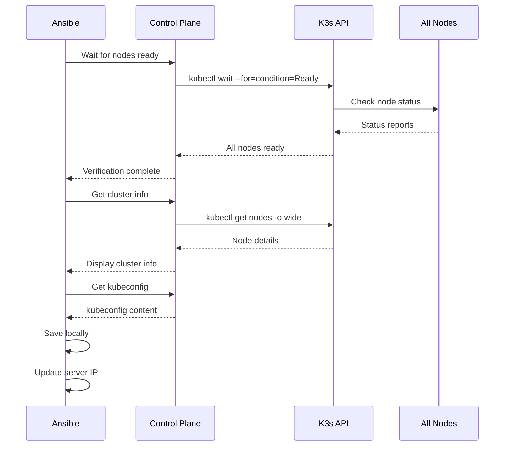

## Phase 4: Finalization

### Kubeconfig Retrieval


**Process**:
1. Read `/etc/rancher/k3s/k3s.yaml` from control plane
2. Replace `127.0.0.1` with control plane IP
3. Save to `./kubeconfig`
4. Set permissions to 600
5. Verify with `kubectl get nodes`

### Optional: ArgoCD Installation

**Playbook**: `ansible/argocd-install.yml`

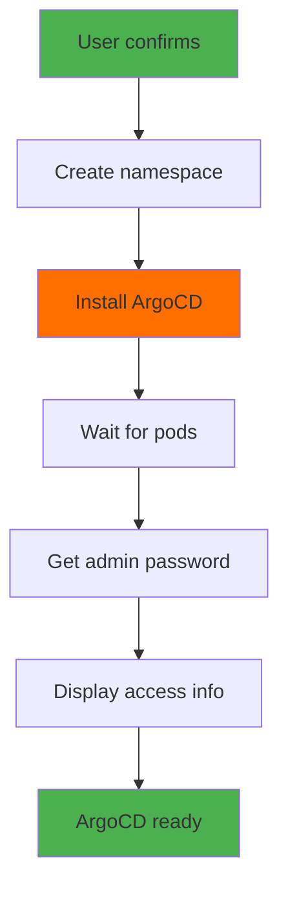

**Installation Steps**:
1. Create `argocd` namespace
2. Apply ArgoCD manifests
3. Wait for pods to be ready
4. Retrieve admin password
5. Display access instructions

## Deployment Timeline

### Development Environment
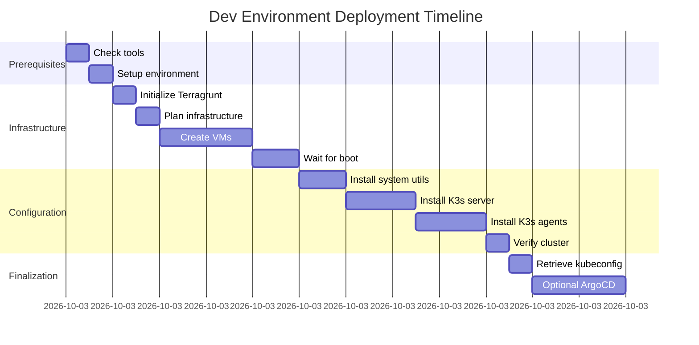

**Total Time**: ~10-12 minutes (without ArgoCD)

### Production Environment
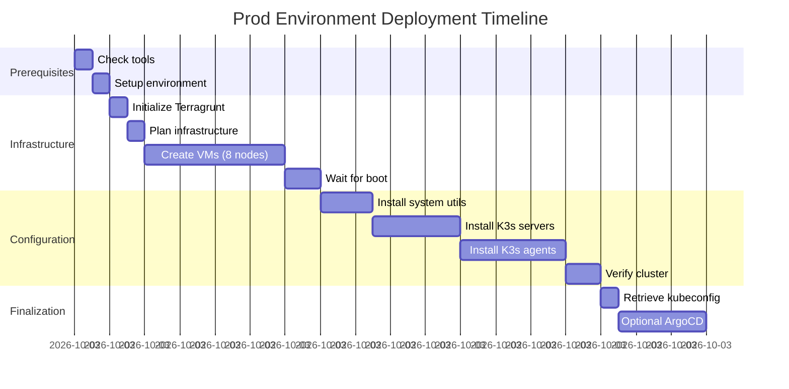

**Total Time**: ~15-18 minutes (without ArgoCD)

## Error Handling

### Common Failure Points
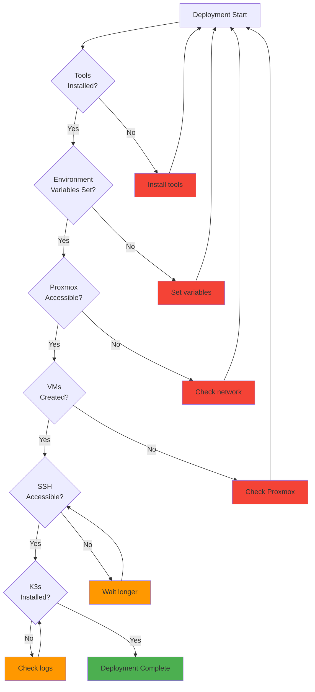

### Retry Logic
- **SSH Connection**: 5 retries with 10-second delay
- **Node Ready**: 5 retries with 10-second delay
- **API Server**: 300-second timeout

## State Management

### Terraform State Flow
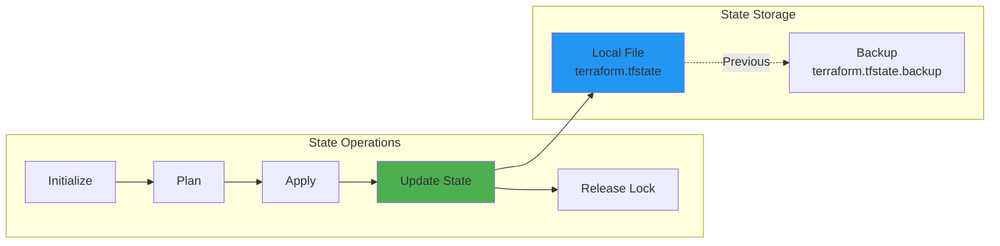

### State File Location
- **Dev**: `./terraform.tfstate`
- **Prod**: `./terraform.tfstate`
- **Backup**: Automatic on each apply

## Rollback Procedures

### Infrastructure Rollback
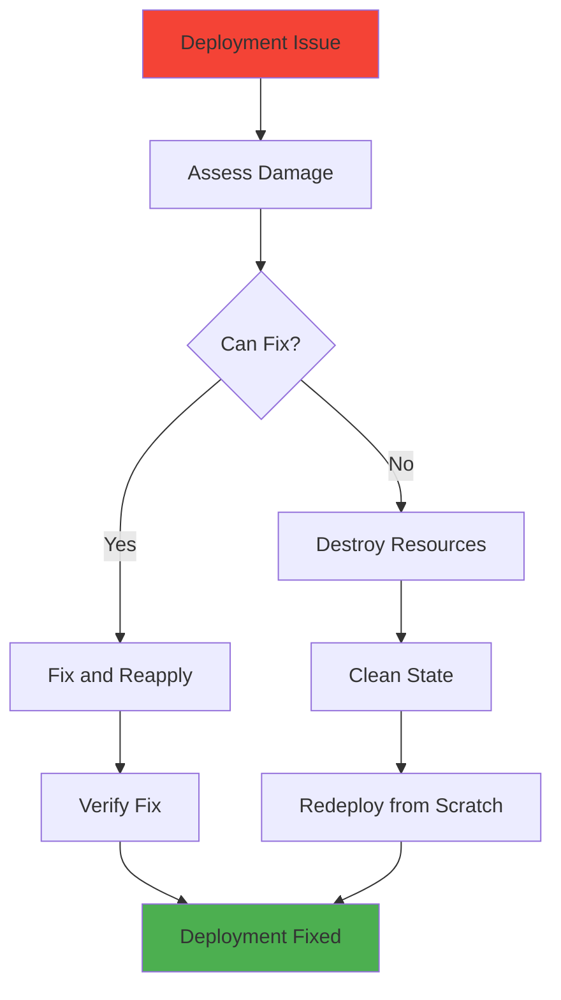

### Rollback Commands
```bash
# Destroy infrastructure
cd environments/dev
terragrunt destroy

# Clean cache
rm -rf .terragrunt-cache

# Redeploy
terragrunt apply
```

## Monitoring Deployment

### Log Locations
- **Terragrunt**: Console output
- **OpenTofu**: `opentofu-plugin-proxmox.log`
- **Ansible**: Console output
- **K3s**: `journalctl -u k3s`

### Health Checks
```bash
# Check VMs
ssh root@proxmox "qm list | grep k3s"

# Check K3s service
ssh ubuntu@192.168.1.180 "systemctl status k3s"

# Check cluster
export KUBECONFIG=./kubeconfig
kubectl get nodes
kubectl get pods -A
```

## Best Practices

1. **Always verify prerequisites** before starting deployment
2. **Use environment variables** for sensitive data
3. **Test in dev** before deploying to prod
4. **Monitor logs** during deployment
5. **Verify each phase** before proceeding
6. **Keep backups** of state files
7. **Document changes** to configuration
8. **Use version control** for all config files

## References

- [Terragrunt Documentation](https://terragrunt.gruntwork.io/docs/)
- [OpenTofu Documentation](https://opentofu.org/docs/)
- [Ansible Documentation](https://docs.ansible.com/)
- [K3s Installation](https://docs.k3s.io/installation)
